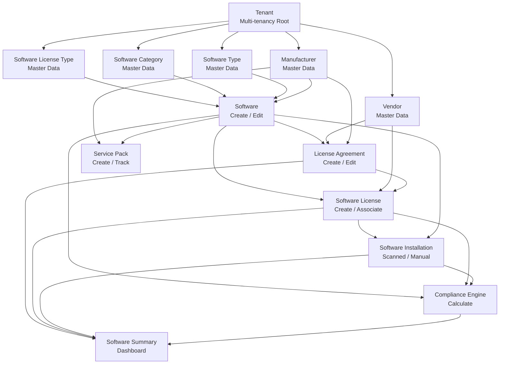
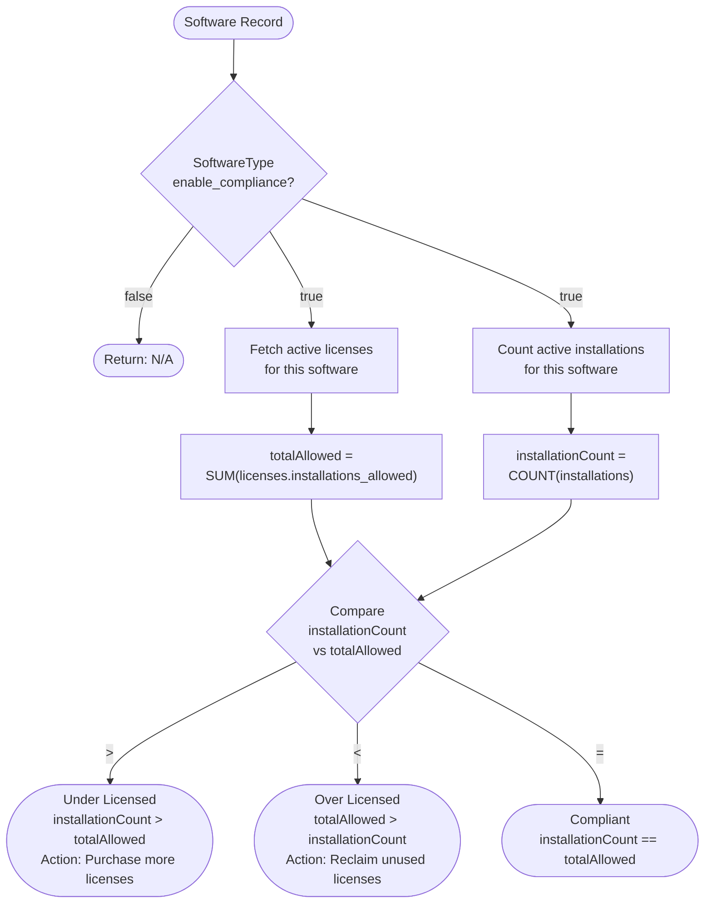
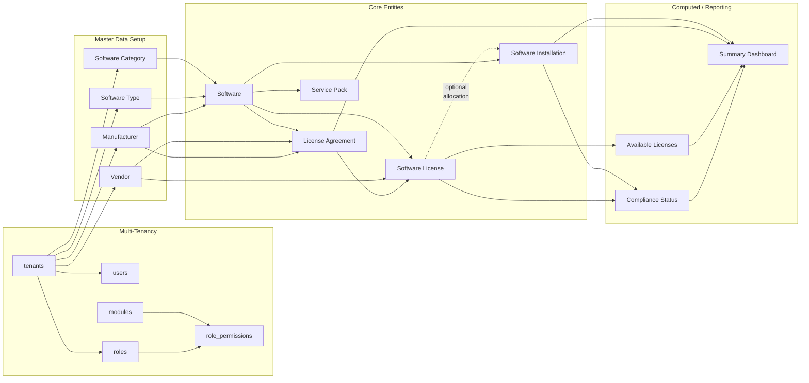

# Software Module — ERD & Relationship Documentation

> **Scope**: Software module entities only. Asset module tables are listed where shared (Manufacturer, Vendor) but their internal relationships are out of scope.  
> **Source of truth**: Live Neon PostgreSQL database (introspected via `npx prisma db pull`)  
> **Compliance engine**: `backend/src/controllers/softwareController.ts → computeCompliance()`

---

## Table of Contents

1. [Mermaid ER Diagram](#1-mermaid-er-diagram)
2. [dbdiagram.io DBML Script](#2-dbdiagramio-dbml-script)
3. [Relationship Matrix](#3-relationship-matrix)
4. [Table Documentation](#4-table-documentation)
5. [Module Flow Diagram](#5-module-flow-diagram)
6. [Compliance Flow Diagram](#6-compliance-flow-diagram)
7. [Data Flow Diagram](#7-data-flow-diagram)
8. [Entity Relationship Explanation](#8-entity-relationship-explanation)
9. [Compliance Calculation Documentation](#9-compliance-calculation-documentation)
10. [Architecture Notes](#10-architecture-notes)

---

## 1. Mermaid ER Diagram

```mermaid
erDiagram

    %% ── Multi-Tenancy ────────────────────────────────────────────────────────────

    tenants {
        int  id            PK
        varchar name       "unique"
        text description   "nullable"
        bool is_active     "default true"
        ts   created_at
        ts   updated_at
    }

    %% ── Master Tables ──────────────────────────────────────────────────────────

    manufacturers {
        int  id            PK
        varchar name
        text description   "nullable"
        bool is_active
        ts   created_at
        ts   updated_at
        int  tenant_id     FK "default 6"
    }

    vendors {
        int  id            PK
        varchar name
        varchar currency   "default USD"
        varchar contact_person "nullable"
        varchar email      "nullable"
        varchar phone      "nullable"
        varchar fax        "nullable"
        varchar website    "nullable"
        varchar door_number "nullable"
        varchar street     "nullable"
        varchar landmark   "nullable"
        varchar city       "nullable"
        varchar state      "nullable"
        varchar postal_code "nullable"
        varchar country    "nullable"
        text description   "nullable"
        bool is_active
        ts   created_at
        ts   updated_at
        int  tenant_id     FK "default 6"
    }

    software_types {
        int  id             PK
        varchar name
        text description    "nullable"
        bool enable_compliance "default false"
        bool is_active
        ts   created_at
        ts   updated_at
        int  tenant_id      FK "default 6"
    }

    software_categories {
        int  id             PK
        varchar name
        text description    "nullable"
        bool is_active
        ts   created_at
        ts   updated_at
        int  tenant_id      FK "default 6"
    }

    software_license_types {
        int  id                    PK
        varchar name
        int  manufacturer_id       FK "nullable"
        varchar track_by           "nullable"
        varchar installations_allowed "nullable"
        bool is_perpetual          "default false"
        bool is_free_license       "default false"
        varchar license_option     "nullable"
        text description           "nullable"
        bool is_active
        ts   created_at
        ts   updated_at
        int  tenant_id             FK "default 6"
    }

    %% ── Core Entities ───────────────────────────────────────────────────────────

    softwares {
        int  id                   PK
        varchar software_name
        varchar version           "nullable"
        int  software_type_id     FK
        int  software_category_id FK
        int  manufacturer_id      FK
        int  license_type_id      FK "nullable"
        text description          "nullable"
        json images               "default []"
        bool is_software_suite    "default false"
        float cost                "nullable"
        bool is_active
        ts   created_at
        ts   updated_at
    }

    software_licenses {
        int  id                    PK
        int  software_id           FK
        varchar license_key        "nullable"
        varchar license_type       "nullable"
        varchar license_option     "nullable"
        int  purchased             "default 0"
        int  installations_allowed "default 0"
        int  allocated             "default 0"
        int  available             "default 0"
        float purchase_cost        "nullable"
        ts   acquired_date         "nullable"
        ts   expiry_date           "nullable"
        varchar purchased_for      "nullable"
        varchar allocated_site     "nullable"
        bool is_critical           "default false"
        int  vendor_id             FK "nullable"
        int  agreement_id          FK "nullable"
        json downgrade_rights      "default []"
        bool is_active
        ts   created_at
        ts   updated_at
    }

    software_installations {
        int  id             PK
        int  software_id    FK
        varchar computer_name "nullable"
        varchar user_name   "nullable"
        varchar version     "nullable"
        int  license_id     FK "nullable"
        ts   installed_on   "nullable"
        bool is_active
        ts   created_at
        ts   updated_at
    }

    software_license_agreements {
        int  id                    PK
        int  software_id           FK "nullable"
        int  manufacturer_id       FK "nullable"
        varchar agreement_name
        varchar authorization_number "nullable"
        int  vendor_id             FK "nullable"
        ts   start_date            "nullable"
        ts   end_date              "nullable"
        varchar document_url       "nullable"
        varchar po_number          "nullable"
        varchar po_name            "nullable"
        ts   purchase_date         "nullable"
        text purchase_description  "nullable"
        varchar invoice_number     "nullable"
        ts   invoice_date          "nullable"
        float total_cost           "nullable"
        text terms                 "nullable"
        int  notify_before_days    "nullable"
        bool is_active
        ts   created_at
        ts   updated_at
    }

    service_packs {
        int  id             PK
        varchar name
        text description    "nullable"
        bool is_installed   "default false"
        int  software_id    FK "nullable"
        int  manufacturer_id FK "nullable"
        bool is_active
        ts   created_at
        ts   updated_at
    }

    %% ── RBAC / Auth Tables ──────────────────────────────────────────────────────

    roles {
        int  id            PK
        int  tenant_id     FK "nullable"
        varchar name
        text description   "nullable"
        bool is_active     "default true"
        ts   created_at
        ts   updated_at
    }

    modules {
        int  id            PK
        varchar api_name   "unique"
        varchar display_name
        text description   "nullable"
        varchar category   "nullable"
        bool is_active     "default true"
        ts   created_at
        ts   updated_at
    }

    role_permissions {
        int  id            PK
        int  role_id       FK
        int  module_id     FK
        bool can_view      "default false"
        bool can_add       "default false"
        bool can_edit      "default false"
        bool can_delete    "default false"
        bool can_export    "default false"
        bool can_import    "default false"
        ts   created_at
        ts   updated_at
    }

    users {
        int  id            PK
        int  tenant_id     FK "nullable"
        int  role_id       FK "nullable"
        varchar name
        varchar email      "unique"
        varchar password
        bool is_active     "default true"
        bool is_super_admin "default false"
        ts   created_at
        ts   updated_at
    }

    %% ── Relationships ────────────────────────────────────────────────────────────

    %% Tenancy
    tenants               ||--o{ manufacturers          : "owns"
    tenants               ||--o{ vendors                : "owns"
    tenants               ||--o{ software_types         : "owns"
    tenants               ||--o{ software_categories    : "owns"
    tenants               ||--o{ software_license_types : "owns"
    tenants               ||--o{ roles                  : "owns"
    tenants               ||--o{ users                  : "owns"

    %% Master → Core
    manufacturers         ||--o{ softwares                   : "manufactures"
    manufacturers         ||--o{ software_license_types      : "defines"
    manufacturers         ||--o{ software_license_agreements : "party to"
    manufacturers         ||--o{ service_packs               : "releases"

    vendors               ||--o{ software_licenses           : "sold via"
    vendors               ||--o{ software_license_agreements : "party to"

    software_types        ||--o{ softwares                   : "typed as"
    software_categories   ||--o{ softwares                   : "categorized as"
    software_license_types |o--o{ softwares                  : "default license type"

    softwares             ||--o{ software_licenses           : "has"
    softwares             ||--o{ software_installations      : "installed on"
    softwares             |o--o{ software_license_agreements : "covered by"
    softwares             |o--o{ service_packs               : "patched by"

    software_license_agreements ||--o{ software_licenses     : "includes"

    software_licenses     |o--o{ software_installations      : "allocated to"

    %% RBAC
    roles                 ||--o{ role_permissions            : "grants"
    modules               ||--o{ role_permissions            : "controls"
    roles                 ||--o{ users                       : "assigned to"
```



---

## 2. dbdiagram.io DBML Script

Paste this directly at [dbdiagram.io](https://dbdiagram.io) to render an interactive diagram.

```dbml
// ─── Software Module ERD ────────────────────────────────────────────────────
// Source: Live Neon PostgreSQL database (introspected 2026-06-12)
// Generated for: Asset Management – Software Module

// ── Multi-Tenancy ─────────────────────────────────────────────────────────────

Table tenants {
  id          int          [pk, increment]
  name        varchar(255) [not null, unique]
  description text         [null]
  is_active   boolean      [not null, default: true]
  created_at  timestamp    [not null, default: `now()`]
  updated_at  timestamp    [not null]

  Note: 'Root tenant record. All master tables are scoped to a tenant via tenant_id FK.'
}

// ── Shared Masters ────────────────────────────────────────────────────────────

Table manufacturers {
  id          int          [pk, increment, note: 'Primary key']
  name        varchar(255) [not null]
  description text         [null]
  is_active   boolean      [not null, default: true]
  created_at  timestamp    [not null, default: `now()`]
  updated_at  timestamp    [not null]
  tenant_id   int          [not null, default: 6, ref: > tenants.id]

  Note: 'Shared master – used by Products, Softwares, Licenses, Agreements, ServicePacks. Scoped to tenant.'
}

Table vendors {
  id             int          [pk, increment]
  name           varchar(255) [not null]
  currency       varchar(10)  [not null, default: 'USD']
  contact_person varchar(255) [null]
  email          varchar(255) [null]
  phone          varchar(50)  [null]
  fax            varchar(50)  [null]
  website        varchar(255) [null]
  is_active      boolean      [not null, default: true]
  description    text         [null]
  door_number    varchar(50)  [null]
  street         varchar(255) [null]
  landmark       varchar(255) [null]
  city           varchar(100) [null]
  state          varchar(100) [null]
  postal_code    varchar(20)  [null]
  country        varchar(100) [null]
  created_at     timestamp    [not null, default: `now()`]
  updated_at     timestamp    [not null]
  tenant_id      int          [not null, default: 6, ref: > tenants.id]
}

// ── Software Type Masters ──────────────────────────────────────────────────────

Table software_types {
  id                int          [pk, increment]
  name              varchar(255) [not null]
  description       text         [null]
  enable_compliance boolean      [not null, default: false, note: 'Enables compliance engine for this type']
  is_active         boolean      [not null, default: true]
  created_at        timestamp    [not null, default: `now()`]
  updated_at        timestamp    [not null]
  tenant_id         int          [not null, default: 6, ref: > tenants.id]
}

Table software_categories {
  id          int          [pk, increment]
  name        varchar(255) [not null]
  description text         [null]
  is_active   boolean      [not null, default: true]
  created_at  timestamp    [not null, default: `now()`]
  updated_at  timestamp    [not null]
  tenant_id   int          [not null, default: 6, ref: > tenants.id]
}

Table software_license_types {
  id                    int          [pk, increment]
  name                  varchar(255) [not null]
  manufacturer_id       int          [null, ref: > manufacturers.id]
  track_by              varchar(100) [null]
  installations_allowed varchar(100) [null]
  is_perpetual          boolean      [not null, default: false]
  is_free_license       boolean      [not null, default: false]
  license_option        varchar(100) [null]
  description           text         [null]
  is_active             boolean      [not null, default: true]
  created_at            timestamp    [not null, default: `now()`]
  updated_at            timestamp    [not null]
  tenant_id             int          [not null, default: 6, ref: > tenants.id]
}

// ── Core Software Entity ───────────────────────────────────────────────────────

Table softwares {
  id                   int          [pk, increment]
  software_name        varchar(255) [not null]
  version              varchar(100) [null]
  software_type_id     int          [not null, ref: > software_types.id]
  software_category_id int          [not null, ref: > software_categories.id]
  manufacturer_id      int          [not null, ref: > manufacturers.id]
  license_type_id      int          [null, ref: > software_license_types.id]
  description          text         [null]
  images               json         [not null, default: '[]']
  is_software_suite    boolean      [not null, default: false]
  cost                 float        [null]
  is_active            boolean      [not null, default: true]
  created_at           timestamp    [not null, default: `now()`]
  updated_at           timestamp    [not null]

  Note: 'Central Software entity. No tenant_id — tenancy is inherited via manufacturer/type/category FKs. Soft-deleted. Compliance computed at query time.'
}

// ── Licenses ───────────────────────────────────────────────────────────────────

Table software_licenses {
  id                    int          [pk, increment]
  software_id           int          [not null, ref: > softwares.id]
  license_key           varchar(500) [null]
  license_type          varchar(100) [null, note: 'Individual | Volume | Named License | Upgrade License | etc.']
  license_option        varchar(100) [null]
  purchased             int          [not null, default: 0, note: 'Total license seats purchased']
  installations_allowed int          [not null, default: 0, note: 'Max concurrent installations permitted']
  allocated             int          [not null, default: 0, note: 'Seats currently allocated']
  available             int          [not null, default: 0, note: 'installations_allowed - allocated']
  purchase_cost         float        [null]
  acquired_date         timestamp    [null]
  expiry_date           timestamp    [null]
  purchased_for         varchar(255) [null, note: 'Department / Upgrade-From software reference']
  allocated_site        varchar(255) [null, note: 'Site / organization name']
  is_critical           boolean      [not null, default: false]
  vendor_id             int          [null, ref: > vendors.id]
  agreement_id          int          [null, ref: > software_license_agreements.id]
  downgrade_rights      json         [not null, default: '[]', note: '[{softwareName, licenseKey}]']
  is_active             boolean      [not null, default: true]
  created_at            timestamp    [not null, default: `now()`]
  updated_at            timestamp    [not null]

  Note: 'No tenant_id column. Tenancy flows from softwares → manufacturers → tenant_id.'
}

// ── Installations (Scanned Software) ──────────────────────────────────────────

Table software_installations {
  id            int          [pk, increment]
  software_id   int          [not null, ref: > softwares.id]
  computer_name varchar(255) [null, note: 'Workstation hostname']
  user_name     varchar(255) [null]
  version       varchar(100) [null]
  license_id    int          [null, ref: > software_licenses.id, note: 'Nullable – unallocated installations exist']
  installed_on  timestamp    [null]
  is_active     boolean      [not null, default: true]
  created_at    timestamp    [not null, default: `now()`]
  updated_at    timestamp    [not null]

  Note: 'Each row = one discovered installation on one workstation. No tenant_id column.'
}

// ── License Agreements ────────────────────────────────────────────────────────

Table software_license_agreements {
  id                   int          [pk, increment]
  software_id          int          [null, ref: > softwares.id]
  manufacturer_id      int          [null, ref: > manufacturers.id]
  agreement_name       varchar(255) [not null, note: 'Agreement Number']
  authorization_number varchar(255) [null]
  vendor_id            int          [null, ref: > vendors.id]
  start_date           timestamp    [null, note: 'Active From']
  end_date             timestamp    [null, note: 'Expiry Date']
  document_url         varchar(500) [null]
  po_number            varchar(100) [null]
  po_name              varchar(255) [null]
  purchase_date        timestamp    [null]
  purchase_description text         [null]
  invoice_number       varchar(100) [null]
  invoice_date         timestamp    [null]
  total_cost           float        [null]
  terms                text         [null]
  notify_before_days   int          [null, note: 'Days before expiry to notify users']
  is_active            boolean      [not null, default: true]
  created_at           timestamp    [not null, default: `now()`]
  updated_at           timestamp    [not null]

  Note: 'No tenant_id column. A legal agreement covering one or more software licenses. Status (Active/Expired) computed at runtime.'
}

// ── Service Packs ─────────────────────────────────────────────────────────────

Table service_packs {
  id              int          [pk, increment]
  name            varchar(255) [not null]
  description     text         [null]
  is_installed    boolean      [not null, default: false]
  software_id     int          [null, ref: > softwares.id]
  manufacturer_id int          [null, ref: > manufacturers.id]
  is_active       boolean      [not null, default: true]
  created_at      timestamp    [not null, default: `now()`]
  updated_at      timestamp    [not null]

  Note: 'No tenant_id column.'
}

// ── RBAC / Auth Tables ────────────────────────────────────────────────────────

Table roles {
  id          int          [pk, increment]
  tenant_id   int          [null, ref: > tenants.id]
  name        varchar(255) [not null]
  description text         [null]
  is_active   boolean      [not null, default: true]
  created_at  timestamp    [not null, default: `now()`]
  updated_at  timestamp    [not null]

  indexes {
    (tenant_id, name) [unique]
  }
}

Table modules {
  id           int          [pk, increment]
  api_name     varchar(100) [not null, unique]
  display_name varchar(255) [not null]
  description  text         [null]
  category     varchar(100) [null]
  is_active    boolean      [not null, default: true]
  created_at   timestamp    [not null, default: `now()`]
  updated_at   timestamp    [not null]
}

Table role_permissions {
  id         int     [pk, increment]
  role_id    int     [not null, ref: > roles.id]
  module_id  int     [not null, ref: > modules.id]
  can_view   boolean [not null, default: false]
  can_add    boolean [not null, default: false]
  can_edit   boolean [not null, default: false]
  can_delete boolean [not null, default: false]
  can_export boolean [not null, default: false]
  can_import boolean [not null, default: false]
  created_at timestamp [not null, default: `now()`]
  updated_at timestamp [not null]

  indexes {
    (role_id, module_id) [unique]
  }
}

Table users {
  id             int          [pk, increment]
  tenant_id      int          [null, ref: > tenants.id]
  role_id        int          [null, ref: > roles.id]
  name           varchar(255) [not null]
  email          varchar(255) [not null, unique]
  password       varchar(255) [not null]
  is_active      boolean      [not null, default: true]
  is_super_admin boolean      [not null, default: false]
  created_at     timestamp    [not null, default: `now()`]
  updated_at     timestamp    [not null]
}

// ─── References Summary ────────────────────────────────────────────────────────

// Tenancy refs
Ref: manufacturers.tenant_id        > tenants.id
Ref: vendors.tenant_id              > tenants.id
Ref: software_types.tenant_id       > tenants.id
Ref: software_categories.tenant_id  > tenants.id
Ref: software_license_types.tenant_id > tenants.id
Ref: roles.tenant_id                > tenants.id
Ref: users.tenant_id                > tenants.id

// Core software refs
Ref: softwares.software_type_id     > software_types.id
Ref: softwares.software_category_id > software_categories.id
Ref: softwares.manufacturer_id      > manufacturers.id
Ref: softwares.license_type_id      > software_license_types.id

Ref: software_license_types.manufacturer_id > manufacturers.id

Ref: software_licenses.software_id  > softwares.id
Ref: software_licenses.vendor_id    > vendors.id
Ref: software_licenses.agreement_id > software_license_agreements.id

Ref: software_installations.software_id > softwares.id
Ref: software_installations.license_id  > software_licenses.id

Ref: software_license_agreements.software_id     > softwares.id
Ref: software_license_agreements.manufacturer_id > manufacturers.id
Ref: software_license_agreements.vendor_id       > vendors.id

Ref: service_packs.software_id     > softwares.id
Ref: service_packs.manufacturer_id > manufacturers.id

// RBAC refs
Ref: role_permissions.role_id   > roles.id
Ref: role_permissions.module_id > modules.id
Ref: users.role_id              > roles.id
```

---

## 3. Relationship Matrix

| From Table | To Table | FK Column | Cardinality | Nullable |
|---|---|---|---|---|
| `manufacturers` | `tenants` | `tenant_id` | N:1 | No (default 6) |
| `vendors` | `tenants` | `tenant_id` | N:1 | No (default 6) |
| `software_types` | `tenants` | `tenant_id` | N:1 | No (default 6) |
| `software_categories` | `tenants` | `tenant_id` | N:1 | No (default 6) |
| `software_license_types` | `tenants` | `tenant_id` | N:1 | No (default 6) |
| `softwares` | `software_types` | `software_type_id` | N:1 | No |
| `softwares` | `software_categories` | `software_category_id` | N:1 | No |
| `softwares` | `manufacturers` | `manufacturer_id` | N:1 | No |
| `softwares` | `software_license_types` | `license_type_id` | N:1 | Yes |
| `software_license_types` | `manufacturers` | `manufacturer_id` | N:1 | Yes |
| `software_licenses` | `softwares` | `software_id` | N:1 | No |
| `software_licenses` | `vendors` | `vendor_id` | N:1 | Yes |
| `software_licenses` | `software_license_agreements` | `agreement_id` | N:1 | Yes |
| `software_installations` | `softwares` | `software_id` | N:1 | No |
| `software_installations` | `software_licenses` | `license_id` | N:1 | Yes |
| `software_license_agreements` | `softwares` | `software_id` | N:1 | Yes |
| `software_license_agreements` | `manufacturers` | `manufacturer_id` | N:1 | Yes |
| `software_license_agreements` | `vendors` | `vendor_id` | N:1 | Yes |
| `service_packs` | `softwares` | `software_id` | N:1 | Yes |
| `service_packs` | `manufacturers` | `manufacturer_id` | N:1 | Yes |
| `roles` | `tenants` | `tenant_id` | N:1 | Yes |
| `users` | `tenants` | `tenant_id` | N:1 | Yes |
| `users` | `roles` | `role_id` | N:1 | Yes |
| `role_permissions` | `roles` | `role_id` | N:1 | No |
| `role_permissions` | `modules` | `module_id` | N:1 | No |

**Cardinality Legend**

| Notation | Meaning |
|---|---|
| `1:1` | One row in table A relates to exactly one row in table B |
| `1:N` | One row in table A relates to many rows in table B |
| `N:1` | Many rows in table A belong to one row in table B |
| `N:N` | Implemented via a junction table (none in this module) |

> **Multi-tenancy pattern**: Master tables (`manufacturers`, `vendors`, `software_types`, `software_categories`, `software_license_types`) carry a `tenant_id` FK to `tenants`. Core transactional tables (`softwares`, `software_licenses`, `software_installations`, `software_license_agreements`, `service_packs`) do **not** have `tenant_id` — they inherit tenant scope transitively through their FK chain.

> **No true M:N relationships** in the Software module. The `downgrade_rights` JSON column on `software_licenses` stores embedded sub-objects rather than using a junction table.

---

## 4. Table Documentation

---

### Table: `softwares`

**Purpose**  
Central entity representing a software product (e.g., "Microsoft Office 365"). One row = one distinct software title. Serves as the parent for licenses, installations, agreements, and service packs.

> **No `tenant_id` column** — tenant scope is inherited via `manufacturer_id → manufacturers.tenant_id`.

| Column | Type | Constraints | Description |
|---|---|---|---|
| `id` | int | PK, auto-increment | Surrogate primary key |
| `software_name` | varchar | NOT NULL | Display name of the software |
| `version` | varchar | nullable | Version string |
| `software_type_id` | int | FK → software_types | Required type classification |
| `software_category_id` | int | FK → software_categories | Required category classification |
| `manufacturer_id` | int | FK → manufacturers | Required publisher/manufacturer |
| `license_type_id` | int | FK → software_license_types, nullable | Optional default license type |
| `description` | text | nullable | — |
| `images` | json | default `[]` | Array of image URL strings |
| `is_software_suite` | bool | default false | True if this is a bundle of products |
| `cost` | float | nullable | Unit cost |
| `is_active` | bool | default true | Soft-delete flag |
| `created_at` | timestamp | — | Auto-set on INSERT |
| `updated_at` | timestamp | — | Auto-set on UPDATE |

**Relationships**

| Direction | Related Table | Type | Via |
|---|---|---|---|
| BelongsTo | `manufacturers` | N:1 | `manufacturer_id` |
| BelongsTo | `software_types` | N:1 | `software_type_id` |
| BelongsTo | `software_categories` | N:1 | `software_category_id` |
| BelongsTo (opt) | `software_license_types` | N:1 | `license_type_id` |
| HasMany | `software_licenses` | 1:N | `software_licenses.software_id` |
| HasMany | `software_installations` | 1:N | `software_installations.software_id` |
| HasMany (opt) | `software_license_agreements` | 1:N | `software_license_agreements.software_id` |
| HasMany (opt) | `service_packs` | 1:N | `service_packs.software_id` |

---

### Table: `software_types`

**Purpose**  
Classification master for software (e.g., Desktop Application, Server Software, Security). Controls whether the compliance engine is active for software of this type.

> **Has `tenant_id`** — scoped to a tenant.

| Column | Type | Constraints | Description |
|---|---|---|---|
| `id` | int | PK | — |
| `name` | varchar | NOT NULL | Type name |
| `description` | text | nullable | — |
| `enable_compliance` | bool | default false | **Activates compliance calculation** for all softwares of this type |
| `is_active` | bool | default true | Soft-delete |
| `tenant_id` | int | FK → tenants, default 6 | Multi-tenancy scope |

**Key Business Rule**: `enable_compliance = true` → `computeCompliance()` returns Under/Over/Compliant. `enable_compliance = false` → returns `"N/A"`.

---

### Table: `software_categories`

**Purpose**  
Secondary classification of software (e.g., Productivity, Security, Development). Independent of type — a software has exactly one category.

> **Has `tenant_id`** — scoped to a tenant.

| Column | Type | Constraints | Description |
|---|---|---|---|
| `id` | int | PK | — |
| `name` | varchar | NOT NULL | Category name |
| `description` | text | nullable | — |
| `is_active` | bool | default true | Soft-delete |
| `tenant_id` | int | FK → tenants, default 6 | Multi-tenancy scope |

---

### Table: `software_license_types`

**Purpose**  
Definition of available license models (e.g., Perpetual, Subscription, Per-Device). Can be scoped to a specific manufacturer. Referenced optionally by `softwares.license_type_id`.

> **Has `tenant_id`** — scoped to a tenant.

| Column | Type | Constraints | Description |
|---|---|---|---|
| `id` | int | PK | — |
| `name` | varchar | NOT NULL | License model name |
| `manufacturer_id` | int | FK → manufacturers, nullable | Optional manufacturer scope |
| `track_by` | varchar | nullable | Tracking method (e.g., User, Device) |
| `installations_allowed` | varchar | nullable | Allowed installation count rule |
| `is_perpetual` | bool | default false | Does not expire |
| `is_free_license` | bool | default false | Zero-cost license |
| `license_option` | varchar | nullable | License option descriptor |
| `description` | text | nullable | — |
| `tenant_id` | int | FK → tenants, default 6 | Multi-tenancy scope |

---

### Table: `software_licenses`

**Purpose**  
Stores each purchased license key or license block for a specific software. Tracks quantitative compliance counters (`purchased`, `installations_allowed`, `allocated`, `available`). One software can have many licenses.

> **No `tenant_id` column** — tenant scope inherited through `software_id → softwares → manufacturer_id → manufacturers.tenant_id`.

| Column | Type | Constraints | Description |
|---|---|---|---|
| `id` | int | PK | — |
| `software_id` | int | FK → softwares, NOT NULL | Owning software |
| `license_key` | varchar | nullable | Actual key string |
| `license_type` | varchar | nullable | Individual / Volume / Named License / Upgrade License |
| `license_option` | varchar | nullable | Single User / Multi User / etc. |
| `purchased` | int | default 0 | Total seats/keys purchased |
| `installations_allowed` | int | default 0 | Max simultaneous installs permitted |
| `allocated` | int | default 0 | Seats assigned to workstations |
| `available` | int | default 0 | `installations_allowed − allocated` (maintained by app) |
| `purchase_cost` | float | nullable | Cost of this license |
| `acquired_date` | timestamp | nullable | Purchase/acquisition date |
| `expiry_date` | timestamp | nullable | Expiry date |
| `purchased_for` | varchar | nullable | Department reference (or Upgrade-From software for Upgrade License type) |
| `allocated_site` | varchar | nullable | Site/organization name |
| `is_critical` | bool | default false | Flag critical licenses |
| `vendor_id` | int | FK → vendors, nullable | Supplier |
| `agreement_id` | int | FK → software_license_agreements, nullable | Parent agreement |
| `downgrade_rights` | json | default `[]` | `[{softwareName: string, licenseKey: string}]` |

**Business Rules**
- `available = installations_allowed − allocated` is maintained by the application (not a DB computed column).
- `license_type = 'Upgrade License'` is a special mode: `purchased_for` stores the upgrade-from software reference.
- A license with `agreement_id = null` is an **unassociated** license (shown in the form's info banner count).

---

### Table: `software_installations`

**Purpose**  
Each row represents one discovered installation of a software on a specific workstation. Populated by network scanning. The `license_id` FK is nullable — an installation without a license means it is **unallocated** and may contribute to an Under Licensed status.

> **No `tenant_id` column** — tenant scope inherited through `software_id → softwares → manufacturer_id → manufacturers.tenant_id`.

| Column | Type | Constraints | Description |
|---|---|---|---|
| `id` | int | PK | — |
| `software_id` | int | FK → softwares, NOT NULL | Which software was installed |
| `computer_name` | varchar | nullable | Workstation hostname |
| `user_name` | varchar | nullable | Logged-in user at time of scan |
| `version` | varchar | nullable | Installed version |
| `license_id` | int | FK → software_licenses, nullable | Allocated license, if any |
| `installed_on` | timestamp | nullable | Scan / install date |

**Compliance Role**: `installationCount = COUNT(software_installations WHERE software_id = X AND is_active = true)`. This count is compared against `SUM(software_licenses.installations_allowed)` to determine compliance status.

---

### Table: `software_license_agreements`

**Purpose**  
Legal/commercial agreement covering a set of software licenses. One agreement can cover multiple `software_licenses` rows (linked via `software_licenses.agreement_id`). Optionally scoped to one software or to a manufacturer.

> **No `tenant_id` column** — tenant scope flows from `manufacturer_id → manufacturers.tenant_id` or from associated software.

| Column | Type | Constraints | Description |
|---|---|---|---|
| `id` | int | PK | — |
| `software_id` | int | FK → softwares, nullable | Optional single-software scope |
| `manufacturer_id` | int | FK → manufacturers, nullable | Publisher party |
| `agreement_name` | varchar | NOT NULL | Agreement number / identifier |
| `authorization_number` | varchar | nullable | — |
| `vendor_id` | int | FK → vendors, nullable | Reseller party |
| `start_date` | timestamp | nullable | Agreement active-from date |
| `end_date` | timestamp | nullable | Agreement expiry date |
| `document_url` | varchar | nullable | Link to agreement document |
| `po_number` | varchar | nullable | Purchase order number |
| `po_name` | varchar | nullable | PO display name |
| `purchase_date` | timestamp | nullable | — |
| `purchase_description` | text | nullable | — |
| `invoice_number` | varchar | nullable | — |
| `invoice_date` | timestamp | nullable | — |
| `total_cost` | float | nullable | Total agreement cost |
| `terms` | text | nullable | Terms & conditions text |
| `notify_before_days` | int | nullable | Days ahead to send expiry notification |

**Computed Fields** (returned by API, not stored):

| Computed | Formula | Values |
|---|---|---|
| `status` | `end_date < NOW()` | `Active` / `Expired` |
| `expiresInDays` | `CEIL((end_date − NOW()) / 86400000)` | negative = expired N days ago |

---

### Table: `service_packs`

**Purpose**  
Patches, updates, and service packs for a software title. Tracks whether each pack has been installed in the environment.

> **No `tenant_id` column** — tenant scope inherited through FK chain.

| Column | Type | Constraints | Description |
|---|---|---|---|
| `id` | int | PK | — |
| `name` | varchar | NOT NULL | Service pack name/version |
| `description` | text | nullable | — |
| `is_installed` | bool | default false | Whether this pack is applied |
| `software_id` | int | FK → softwares, nullable | Owning software |
| `manufacturer_id` | int | FK → manufacturers, nullable | Publisher |

---

### Table: `manufacturers` *(Shared Master)*

**Purpose**  
Publisher / manufacturer of hardware and software. Shared with the Asset module (`products` table). Within the Software module, referenced by `softwares`, `software_license_types`, `software_license_agreements`, and `service_packs`.

> **Has `tenant_id`** — scoped to a tenant (default 6).

| Column | Type | Constraints | Description |
|---|---|---|---|
| `id` | int | PK | — |
| `name` | varchar | NOT NULL | — |
| `description` | text | nullable | — |
| `is_active` | bool | default true | Soft-delete |
| `tenant_id` | int | FK → tenants, default 6 | Multi-tenancy scope |

---

### Table: `vendors` *(Shared Master)*

**Purpose**  
Reseller or supplier organisation. Within the Software module, referenced by `software_licenses` and `software_license_agreements`. Includes full address fields.

> **Has `tenant_id`** — scoped to a tenant (default 6).

| Column | Type | Constraints | Description |
|---|---|---|---|
| `id` | int | PK | — |
| `name` | varchar | NOT NULL | — |
| `currency` | varchar | default USD | — |
| `contact_person` | varchar | nullable | — |
| `email` | varchar | nullable | — |
| `phone` | varchar | nullable | — |
| `fax` | varchar | nullable | — |
| `website` | varchar | nullable | — |
| `door_number` | varchar | nullable | Address |
| `street` | varchar | nullable | Address |
| `landmark` | varchar | nullable | Address |
| `city` | varchar | nullable | Address |
| `state` | varchar | nullable | Address |
| `postal_code` | varchar | nullable | Address |
| `country` | varchar | nullable | Address |
| `description` | text | nullable | — |
| `is_active` | bool | default true | Soft-delete |
| `tenant_id` | int | FK → tenants, default 6 | Multi-tenancy scope |

---

### Table: `tenants` *(System)*

**Purpose**  
Root multi-tenancy record. All master tables are scoped to a tenant via `tenant_id` FK. The current deployment uses a single tenant with id = 6 (the default set on all master tables).

| Column | Type | Constraints | Description |
|---|---|---|---|
| `id` | int | PK | — |
| `name` | varchar | NOT NULL, UNIQUE | Tenant name |
| `description` | text | nullable | — |
| `is_active` | bool | default true | — |

---

### Table: `roles` *(RBAC)*

**Purpose**  
User role definitions. Unique per `(tenant_id, name)`. Each role has a set of `role_permissions` governing module-level access.

| Column | Type | Constraints | Description |
|---|---|---|---|
| `id` | int | PK | — |
| `tenant_id` | int | FK → tenants, nullable | Tenant scope |
| `name` | varchar | NOT NULL | Role name (unique within tenant) |
| `description` | text | nullable | — |
| `is_active` | bool | default true | — |

---

### Table: `modules` *(RBAC)*

**Purpose**  
Registry of functional modules in the application. Each module can have per-role permissions.

| Column | Type | Constraints | Description |
|---|---|---|---|
| `id` | int | PK | — |
| `api_name` | varchar | NOT NULL, UNIQUE | Machine-readable name (e.g., `software`, `license-agreements`) |
| `display_name` | varchar | NOT NULL | Human-readable name |
| `description` | text | nullable | — |
| `category` | varchar | nullable | Grouping category |
| `is_active` | bool | default true | — |

---

### Table: `role_permissions` *(RBAC)*

**Purpose**  
CRUD/export/import permission grants per role per module. Unique on `(role_id, module_id)`.

| Column | Type | Constraints | Description |
|---|---|---|---|
| `id` | int | PK | — |
| `role_id` | int | FK → roles, NOT NULL | — |
| `module_id` | int | FK → modules, NOT NULL | — |
| `can_view` | bool | default false | — |
| `can_add` | bool | default false | — |
| `can_edit` | bool | default false | — |
| `can_delete` | bool | default false | — |
| `can_export` | bool | default false | — |
| `can_import` | bool | default false | — |

---

### Table: `users` *(Auth)*

**Purpose**  
Application user accounts. Belongs to a tenant and has one role that governs module permissions.

| Column | Type | Constraints | Description |
|---|---|---|---|
| `id` | int | PK | — |
| `tenant_id` | int | FK → tenants, nullable | Tenant scope |
| `role_id` | int | FK → roles, nullable | Assigned role |
| `name` | varchar | NOT NULL | — |
| `email` | varchar | NOT NULL, UNIQUE | Login identity |
| `password` | varchar | NOT NULL | Hashed password |
| `is_active` | bool | default true | — |
| `is_super_admin` | bool | default false | Bypass all role_permissions |

---

## 5. Module Flow Diagram



---

## 6. Compliance Flow Diagram



---

## 7. Data Flow Diagram



---

## 8. Entity Relationship Explanation

### Tenant → Master Tables

**Cardinality: 1 : N**

All master tables (`manufacturers`, `vendors`, `software_types`, `software_categories`, `software_license_types`) are scoped to a tenant via `tenant_id`. The current deployment operates with a single default tenant (id = 6). The `default(6)` constraint means rows can be inserted without explicitly specifying a tenant.

```
tenants (1) ──── (0..N) manufacturers
tenants (1) ──── (0..N) vendors
tenants (1) ──── (0..N) software_types
tenants (1) ──── (0..N) software_categories
tenants (1) ──── (0..N) software_license_types
```

### Software → License Agreement

**Cardinality: 1 : N (optional)**

One software title *may* be referenced by many license agreements (`software_license_agreements.software_id`). However, `software_id` is nullable — an agreement can also be manufacturer-scoped (not software-specific), covering all software from that manufacturer.

```
softwares (1) ──── (0..N) software_license_agreements
```

### Software → Software License

**Cardinality: 1 : N (required)**

Every software license must belong to exactly one software. One software can have many license rows (e.g., one per purchase order, site, or expiry date).

```
softwares (1) ──── (1..N) software_licenses
```

### Software License → Site

**Cardinality: N:1 (denormalized string)**

The site/organization is stored as a `varchar` string in `software_licenses.allocated_site` rather than as a FK to a `sites` table. This matches the broader project pattern (Asset module also stores site as a string on the asset record).

### Software License → Vendor

**Cardinality: N:1 (optional FK)**

```
software_licenses (0..N) ──── (0..1) vendors
```

A license *may* be purchased through a vendor. `vendor_id` is nullable — direct-purchase licenses have no vendor.

### License Agreement → Purchased Licenses

**Cardinality: 1 : N (optional)**

```
software_license_agreements (1) ──── (0..N) software_licenses
```

Licenses become "associated" with an agreement by setting `software_licenses.agreement_id`. Before association, `agreement_id = null` (the license is "unassociated"). The form's info banner shows the count of unassociated licenses for the selected manufacturer.

### Software → Installations

**Cardinality: 1 : N (required parent)**

```
softwares (1) ──── (0..N) software_installations
```

Every installation record must reference a software. Installations are created by network scan or manual entry.

### Software License → Installation (Allocation)

**Cardinality: 1 : N (optional)**

```
software_licenses (1) ──── (0..N) software_installations
```

When a license seat is allocated to a workstation, `software_installations.license_id` is set. Installations without a `license_id` are **unallocated** — they consume a physical installation slot but are not covered by any purchased license, contributing to an Under Licensed status.

### Software → Compliance

**Not a stored relationship — computed at query time.**

Compliance is a derived value calculated by `computeCompliance()` in `softwareController.ts`:

```
Input:  softwareType.enable_compliance, installationCount, licenses[]
Output: "N/A" | "Under Licensed" | "Over Licensed" | "Compliant"
```

---

## 9. Compliance Calculation Documentation

### Formula

```
totalAllowed     = SUM(software_licenses.installations_allowed)  WHERE software_id = X AND is_active = true
installationCount = COUNT(software_installations)                 WHERE software_id = X AND is_active = true
available        = SUM(software_licenses.available)              = SUM(installations_allowed - allocated)
```

### Status Rules

| Condition | Status | Meaning |
|---|---|---|
| `enable_compliance = false` | **N/A** | Compliance tracking not enabled for this software type |
| `installationCount > totalAllowed` | **Under Licensed** | More installs than permitted — must purchase more licenses |
| `totalAllowed > installationCount` | **Over Licensed** | Excess licenses — candidates for reclamation/downgrade |
| `installationCount == totalAllowed` | **Compliant** | Exactly the right number of licenses |

### Calculation Examples

**Example A — Compliant**

```
Software: Microsoft Office 365
licenses.installations_allowed: [10, 5]  →  totalAllowed = 15
installations (active):          15       →  installationCount = 15
→ 15 == 15  →  Compliant ✓
```

**Example B — Under Licensed**

```
Software: Adobe Acrobat Pro
licenses.installations_allowed: [5]     →  totalAllowed = 5
installations (active):          8      →  installationCount = 8
→ 8 > 5  →  Under Licensed ⚠
Action: Purchase 3 more license seats
```

**Example C — Over Licensed**

```
Software: Windows 11 Pro
licenses.installations_allowed: [100]   →  totalAllowed = 100
installations (active):          62     →  installationCount = 62
→ 100 > 62  →  Over Licensed ℹ
Action: Reclaim 38 unused license seats
```

**Example D — N/A (Compliance disabled)**

```
Software: Internal Tool
softwareType.enable_compliance: false
→  N/A  (no compliance tracking required)
```

### Available Licenses Calculation

```
For each software_license row:
  available = installations_allowed - allocated

Aggregated available for a software:
  availableForAllocation = SUM(software_licenses.available)  WHERE software_id = X
```

> `available` is **not** a DB computed column — it is maintained by the application whenever `allocated` changes (incremented on allocation, decremented on deallocation).

---

## 10. Architecture Notes

### Multi-Tenancy Pattern

The database uses a **partial tenant_id** strategy:

| Table Group | Has `tenant_id` | Reason |
|---|---|---|
| `manufacturers` | ✅ Yes (default 6) | Shared master — tenants can have their own manufacturer list |
| `vendors` | ✅ Yes (default 6) | Shared master — tenants can have their own vendor list |
| `software_types` | ✅ Yes (default 6) | Master classification — tenant-scoped |
| `software_categories` | ✅ Yes (default 6) | Master classification — tenant-scoped |
| `software_license_types` | ✅ Yes (default 6) | Master template — tenant-scoped |
| `softwares` | ❌ No | Inherits tenant through `manufacturer_id` |
| `software_licenses` | ❌ No | Inherits tenant through `software_id` chain |
| `software_installations` | ❌ No | Inherits tenant through `software_id` chain |
| `software_license_agreements` | ❌ No | Inherits tenant through `manufacturer_id` |
| `service_packs` | ❌ No | Inherits tenant through `software_id` or `manufacturer_id` |

The `default(6)` on all `tenant_id` columns means the system is currently single-tenant. The schema is ready for multi-tenant expansion.

### RBAC System

The database contains a full role-based access control system (`tenants`, `roles`, `modules`, `role_permissions`, `users`) that is **not yet wired into the current backend API** (controllers do not enforce permissions). The tables exist in the DB and are structurally complete.

| Table | Purpose |
|---|---|
| `tenants` | Root tenant record (id=6 is the current default) |
| `roles` | User role definitions (scoped per tenant, unique name within tenant) |
| `modules` | Application module registry (api_name, display_name) |
| `role_permissions` | Per-role, per-module CRUD/export/import grants |
| `users` | Application user accounts with tenant + role assignment |

### Soft Deletes

All tables use `is_active boolean` for soft deletion. No records are hard-deleted. API endpoints filter `WHERE is_active = true` by default. Pass `isActive=all` to include inactive records.

### No Junction Tables

The module uses no M:N junction tables. What appear to be M:N relationships are modelled as:

- `downgrade_rights` — embedded JSON on `software_licenses` (avoids a `license_downgrade_rights` table)
- Agreement → Licenses — FK on child (`software_licenses.agreement_id`) enables a 1:N

### Compliance Is Computed, Not Stored

`complianceType` and `expiresInDays` are never persisted. They are derived at query time in the respective controllers:

| Field | Computed In |
|---|---|
| `complianceType` | `softwareController.ts → computeCompliance()` |
| `expiresInDays` | `licenseAgreementController.ts → expiresInDays()` |
| `status` (Active/Expired) | `licenseAgreementController.ts → computeStatus()` |
| `expiresInLabel` | `globalSoftwareLicenseController.ts → expiresInLabel()` |

### Shared Masters

`Manufacturer` and `Vendor` are shared between the Asset module and the Software module. Modifying them affects both modules. Corresponding Prisma relations on these models list both `products`/`assets` (Asset side) and `softwares`/`licenseAgreements` (Software side).

### Database Map

| Prisma Model | DB Table | Has `tenant_id` | Module Role |
|---|---|---|---|
| `Software` | `softwares` | ❌ | Core entity |
| `SoftwareType` | `software_types` | ✅ | Master + compliance flag |
| `SoftwareCategory` | `software_categories` | ✅ | Master |
| `SoftwareLicenseType` | `software_license_types` | ✅ | Master |
| `SoftwareLicense` | `software_licenses` | ❌ | License inventory |
| `SoftwareInstallation` | `software_installations` | ❌ | Scanned / discovered installs |
| `SoftwareLicenseAgreement` | `software_license_agreements` | ❌ | Legal agreements |
| `ServicePack` | `service_packs` | ❌ | Patch management |
| `Manufacturer` | `manufacturers` | ✅ | Shared master |
| `Vendor` | `vendors` | ✅ | Shared master |
| *(tenants)* | `tenants` | — | Multi-tenancy root |
| *(roles)* | `roles` | ✅ | RBAC — role definitions |
| *(modules)* | `modules` | — | RBAC — module registry |
| *(role_permissions)* | `role_permissions` | — | RBAC — permission grants |
| *(users)* | `users` | ✅ | Auth — user accounts |

### API Route Map

| Route | Controller | Purpose |
|---|---|---|
| `GET /api/softwares` | `softwareController.getSoftwares` | Paginated list + compliance |
| `GET /api/softwares/:id` | `softwareController.getSoftware` | Detail + installs + licenses |
| `GET /api/softwares/all` | `softwareController.getAllSoftwares` | Lightweight dropdown list |
| `GET /api/global-software-licenses` | `globalSoftwareLicenseController.getLicensesGlobal` | All licenses across all software |
| `GET /api/license-agreements` | `licenseAgreementController.getAgreements` | Agreements with expiry filter |
| `GET /api/softwares/:id/licenses` | `softwareLicenseController` | Per-software licenses |
| `GET /api/softwares/:id/installations` | `softwareInstallationController` | Per-software installations |
| `GET /api/service-packs` | `servicePackController` | Service packs |

---

*Document generated from live Neon PostgreSQL database introspection via `npx prisma db pull`.*  
*Last updated: 2026-06-12*
