# Software Module – Flowchart & Functional Documentation

> **Codebase:** `Asset-Management` monorepo — Express/Prisma backend + React/Vite frontend  
> **Generated from:** Live code introspection (routes, controllers, pages, types)  
> **Scope:** Software module only — no Asset tables, APIs, or routes are touched.

---

## Table of Contents

1. [High-Level Architecture](#1-high-level-architecture)
2. [Module Map & Routes](#2-module-map--routes)
3. [Software Lifecycle (CRUD)](#3-software-lifecycle-crud)
4. [Compliance Engine](#4-compliance-engine)
5. [License Management Flow](#5-license-management-flow)
6. [License Agreement Flow](#6-license-agreement-flow)
7. [Software Installation (Assignment) Flow](#7-software-installation-assignment-flow)
8. [Service Pack Flow](#8-service-pack-flow)
9. [Permission & Validation Flow](#9-permission--validation-flow)
10. [Soft Delete & Audit Pattern](#10-soft-delete--audit-pattern)
11. [Search, Filter & Pagination](#11-search-filter--pagination)
12. [Software Dashboard (Summary) Flow](#12-software-dashboard-summary-flow)
13. [Reporting & Export Flow](#13-reporting--export-flow)
14. [Data Relationship Diagram](#14-data-relationship-diagram)
15. [Frontend Navigation Map](#15-frontend-navigation-map)

---

## 1. High-Level Architecture

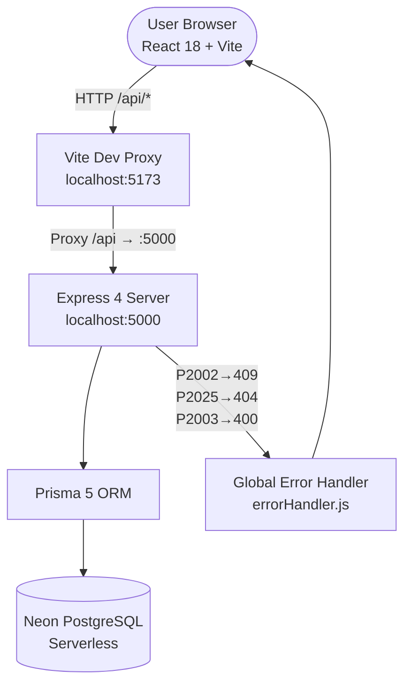

**Explanation:** The browser calls `/api/*` endpoints which Vite proxies to Express on port 5000. Express uses Prisma to query Neon PostgreSQL. A global error handler maps Prisma error codes to HTTP status codes (P2002 = unique conflict, P2025 = not found, P2003 = FK violation).

---

## 2. Module Map & Routes

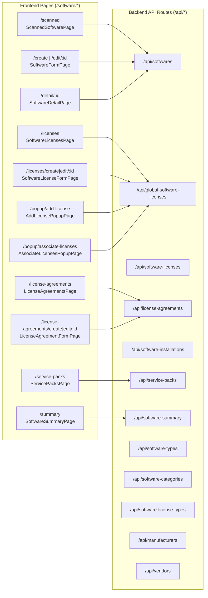

**Explanation:** All frontend pages call specific backend routes. Popup windows (`window.open()`) are standalone React pages that communicate back to their parent via `window.postMessage`. The sidebar navigation links map directly to these page routes.

---

## 3. Software Lifecycle (CRUD)

```mermaid
flowchart TD
    START([User opens Software module]) --> LIST

    subgraph LIST["Scanned Software List — /software/scanned"]
        FETCH["GET /api/softwares\n?page, pageSize, search\n?sortBy, sortOrder\n?manufacturerId, softwareTypeId"]
        RESP["Response:\n{ data[], pagination:\n{ page, pageSize, total, totalPages } }"]
        FETCH --> RESP
    end

    RESP --> ACTION{User Action}

    subgraph CREATE["Create Software — /software/create"]
        CF["SoftwareFormPage\nFields: name*, softwareTypeId*\nsoftwareCategoryId*, manufacturerId*\nversion, description, licenseTypeId"]
        CV{"Validate:\nname required\nsoftwareTypeId required\nsoftwareCategoryId required\nmanufacturerId required"}
        CPOST["POST /api/softwares\n422 if validation fails\n409 if name+mfr duplicate"]
        CSUC["201 Created\nNavigate to /software/scanned\nToast: created successfully"]
        CF --> CV
        CV -->|Fail 422| CERR["Show field errors\nHighlight invalid inputs"]
        CV -->|Pass| CPOST
        CPOST -->|Success| CSUC
        CPOST -->|Conflict 409| CERR
    end

    subgraph VIEW["View Software — /software/detail/:id"]
        VF["GET /api/softwares/:id\nIncludes: softwareType, softwareCategory\nmanufacturer, licenseType\nlicenses, installations\ncomplianceType (computed)"]
        VD["SoftwareDetailPage\nShows all fields + images\n+ compliance badge\n+ associated licenses"]
        VF --> VD
    end

    subgraph EDIT["Edit Software — /software/edit/:id"]
        EF["GET /api/softwares/:id → pre-fill form"]
        EV{"Same validation as Create"}
        EPUT["PUT /api/softwares/:id\nFull payload required\n(name, typeId, categoryId, mfrId)"]
        EPATCH["PATCH /api/softwares/:id\nPartial: softwareTypeId\nsoftwareCategoryId\nmanufacturerId (no name required)"]
        ESUC["200 OK\nToast: updated successfully"]
        EF --> EV
        EV -->|Pass| EPUT
        EPUT -->|Success| ESUC
    end

    subgraph DELETE["Soft Delete — isActive = false"]
        DC["ConfirmDialog shown\nUser must confirm"]
        DDEL["DELETE /api/softwares/:id\nSets isActive = false\nNever hard-deletes"]
        DSUC["200 OK\nRecord hidden from\nisActive=true lists\nToast: deleted"]
        DC --> DDEL --> DSUC
    end

    subgraph IMG["Image Upload"]
        IUP["POST /api/softwares/:id/images\nMultipart/form-data\nMulter middleware\nStored on disk"]
        IDEL["DELETE /api/softwares/:id/images/:filename\nRemoves file + updates images[] JSON"]
        IUP --> IDEL
    end

    ACTION -->|New| CREATE
    ACTION -->|Row click| VIEW
    ACTION -->|Edit| EDIT
    ACTION -->|Delete| DELETE
    ACTION -->|Images| IMG
```

**Explanation:** Software CRUD uses full PUT for complete updates (all 4 required fields) and PATCH for partial field updates (used by Scanned Software bulk actions like Change Type, Change Category, Change Manufacturer). Soft delete sets `isActive = false`; the record never leaves the database. The compliance type (`Under Licensed`, `Over Licensed`, `Compliant`, `N/A`) is computed at query time, not stored.

---

## 4. Compliance Engine

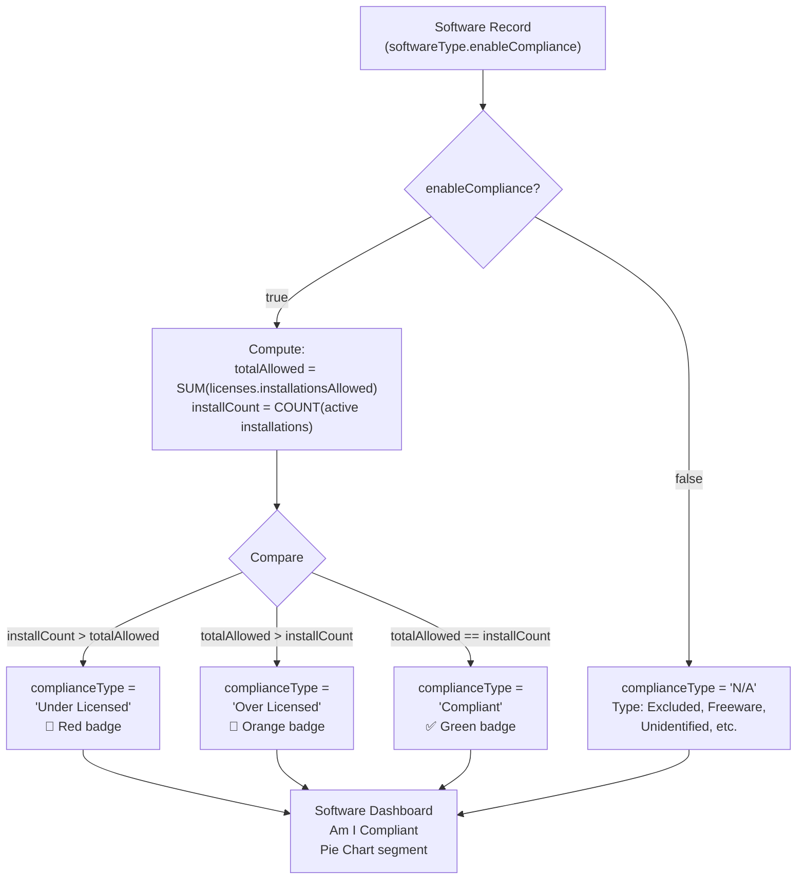

**Explanation:** Compliance is computed in `softwareController.ts → computeCompliance()`. It only fires when `softwareType.enableCompliance = true` (set on Software Types like "Managed", "Prohibited"). Types such as "Freeware", "Excluded", "Unidentified" have `enableCompliance = false`, so they always return `N/A`. The result appears as a badge in the Scanned Software table and drives the dashboard pie chart.

---

## 5. License Management Flow

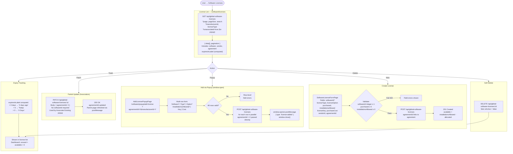

**Explanation:** Licenses live in `softwareLicense` table. `available = installationsAllowed - allocated` is stored and recomputed on every update. The popup path uses `window.open()` + `postMessage` so the parent agreement page refreshes its license grid without a full page reload. `PATCH` (partial) is used only for bulk association changes so callers don't need to re-send all license fields.

---

## 6. License Agreement Flow

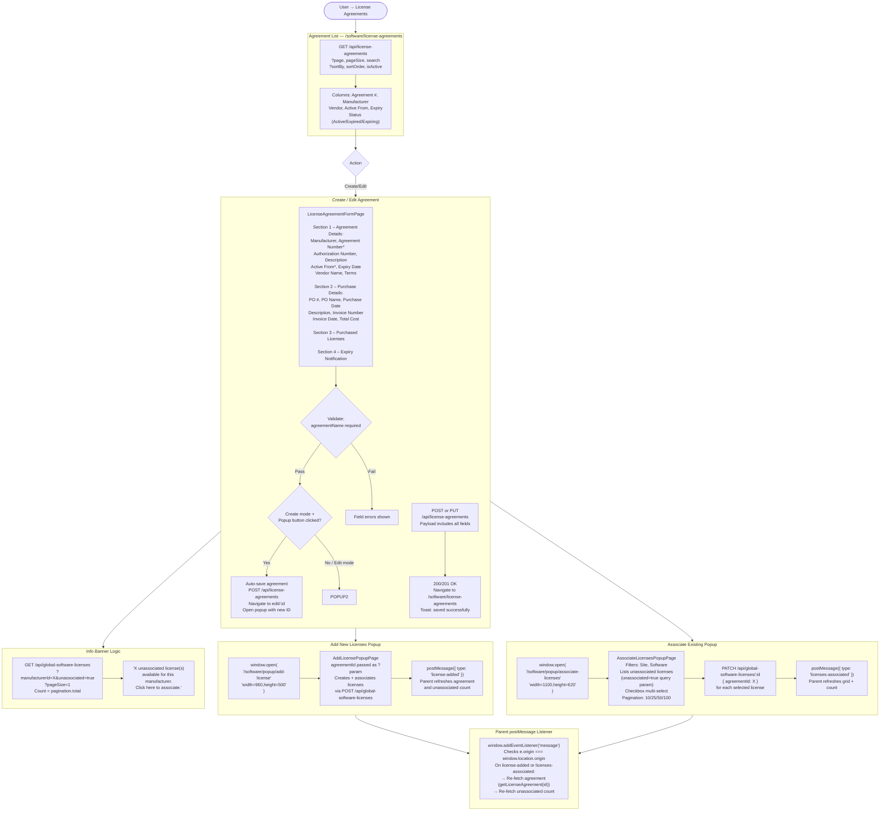

**Explanation:** The agreement form has four sections matching the SDP reference. In **create mode**, clicking either license popup button first auto-saves the agreement (getting a real ID), redirects the parent to edit mode, then opens the popup with the new `agreementId`. The expiry notification section lets users shuttle names between "User List" and "Notified User List" using `>>` / `<<` transfer buttons. `notifyBeforeDays` is stored on the agreement record.

---

## 7. Software Installation (Assignment) Flow

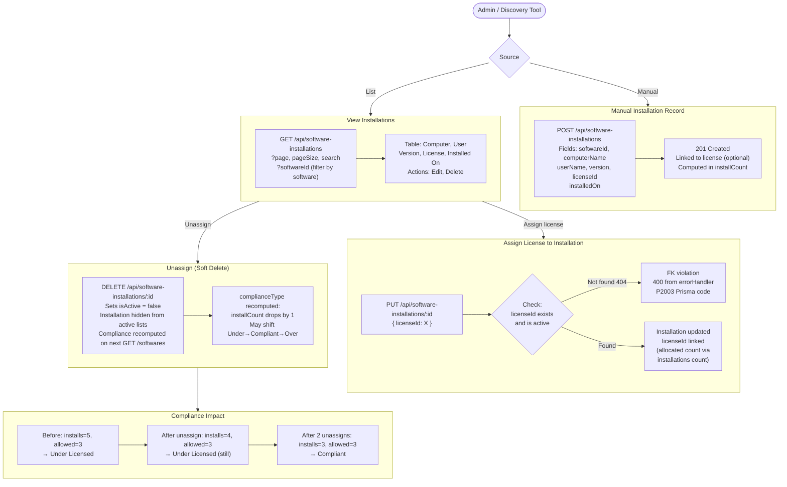

**Explanation:** Installations record the mapping of a software to a computer/user. Linking a `licenseId` to an installation constitutes "assignment". The compliance engine counts `active installations` per software; unassigning (soft-deleting an installation) reduces that count and can shift compliance status. There is no explicit "available license check" gate in the backend — capacity enforcement is handled at the frontend display layer via `availableForAllocation`.

---

## 8. Service Pack Flow

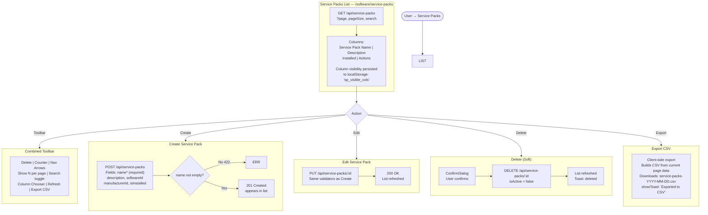

**Explanation:** The Service Packs page uses a single combined toolbar row (modelled after the License Agreements pattern) with inline pagination controls. There is no modal add form — the toolbar's Delete button uses `selected[]` state. Empty state text is `"No Hotfix found in this view."` Column visibility (Description, Installed columns) is persisted to `localStorage` under key `sp_visible_cols`.

---

## 9. Permission & Validation Flow

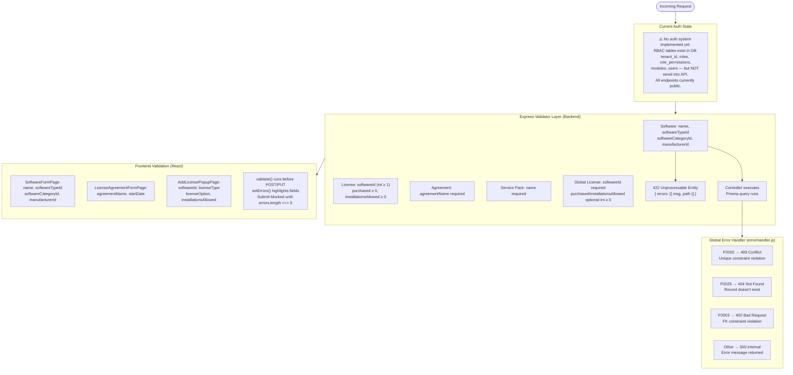

**Explanation:** The system currently has no enforced auth middleware — RBAC tables (`roles`, `role_permissions`, `modules`, `users`) exist in the Neon database but are not wired into Express. Validation is two-layered: frontend `validate()` functions prevent bad requests, and backend `express-validator` chains catch any that bypass the UI. Error messages are surfaced at field level on the form.

---

## 10. Soft Delete & Audit Pattern

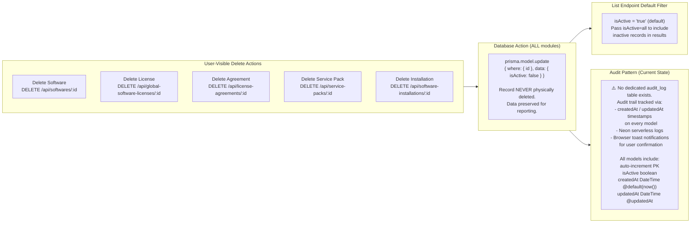

**Explanation:** Every delete in the Software module is a soft delete — `isActive` is set to `false`. No data is physically removed. All list endpoints default to `isActive = 'true'`; callers can pass `isActive=all` to see inactive records. Every model has `createdAt` and `updatedAt` timestamps managed by Prisma, providing a basic change trail. A full audit log table is not yet implemented but the schema supports adding one without breaking changes.

---

## 11. Search, Filter & Pagination

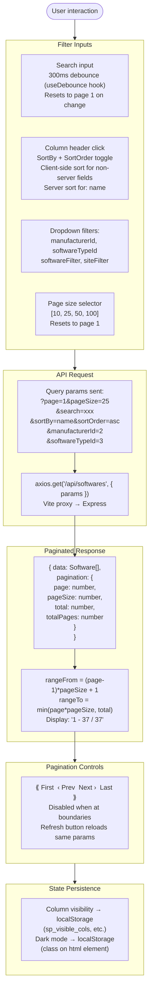

**Explanation:** All list pages follow the same pattern: `useDebounce(rawSearch, 300)` prevents excessive API calls during typing. `useCallback` with dependency arrays ensures `fetchData` only re-runs when relevant params change. Filters reset `page` to 1 to avoid empty result sets. Server-side sorting is applied for indexed fields (like `name`); client-side sorting handles computed columns (like `complianceType`, `installationsCount`).

---

## 12. Software Dashboard (Summary) Flow

```mermaid
flowchart TD
    PAGE([SoftwareSummaryPage loads]) --> FILTERS

    subgraph FILTERS["Top-Right Filters"]
        MFR["Manufacturer dropdown\nfrom GET /api/manufacturers\nAll Manufacturer (default)"]
        SITE["Site dropdown\nStatic list (no sites table)\nAll Sites (default)"]
        MFR --> TRIGGER
        SITE --> TRIGGER
        TRIGGER["Any change → fetchData()\nuseCallback dependency"]
    end

    TRIGGER --> API

    subgraph API["GET /api/software-summary?manufacturerId=X"]
        QUERY["Prisma parallel queries:\nfindMany softwares (with type, licenses, _count.installations)\nfindMany licenses (available, allocated, installationsAllowed)\nfindMany agreements (endDate)"]
        
        COMP_CALC["Compliance:\nFor each software:\n  computeCompliance(enableCompliance, installCount, totalAllowed)\nCounts: underLicensed, overLicensed, compliant, na"]
        
        USAGE_CALC["Usage Buckets:\n0 installs → never\n1-3 → rarely\n4-15 → occasional\n16+ → frequent"]

        AGREE_CALC["Agreement expiry:\nnow: expired\nnow+7: expiring7\nnow+30: expiring30"]

        LIC_CALC["License usage:\nallocated = in use\navailable = not in use\nunused = licenses where available > 0"]
    end

    API --> WIDGETS

    subgraph WIDGETS["Dashboard Widgets (Pure SVG/CSS)"]
        PIE1["Am I Compliant\nSVG Pie Chart\n(strokeDasharray technique)\nSegments: orange, blue, green\nClick → navigate to /software/scanned\n?complianceType=Under Licensed|..."]
        
        PIE2["License Usage Summary\nSVG Pie Chart\nIn Use (orange) vs Not In Use (blue)\nClick → navigate to /software/licenses"]

        BAR["Software Usage Summary\nCSS bar chart\nFrequently / Occasionally\nRarely / Never Used\n(height = % of max value)"]

        STAT1["Software Stats Panel\nTotal, Managed, Prohibited\nUnidentified, More >>\nAll clickable → /software/scanned"]

        STAT2["Unused Licenses\nCount → /software/licenses?filter=unused"]

        STAT3["Rarely Used\nCount from usage.rarely bucket\n→ /software/licenses?filter=rarely-used"]

        STAT4["License Agreement Expiry\nExpired, Next 7 days, Next 30 days\n→ /software/license-agreements?filter=X"]
    end

    WIDGETS --> LAYOUT

    subgraph LAYOUT["2-Column Layout"]
        LEFT["Left column (55%):\n1. Am I Compliant pie\n2. License Usage pie\n3. Software Usage bar"]
        RIGHT["Right column (45%):\n1. Software stats\n2. Unused Licenses\n3. Rarely Used\n4. Agreement Expiry"]
    end
```

**Explanation:** The dashboard uses no external chart library. Both pie charts use the SVG `stroke-dasharray` trick: drawing overlapping circles with `strokeDashoffset` to render colored arcs. The bar chart uses CSS `div` elements with percentage heights. All widgets support empty state (`"No data available"`) and loading state. Clicking any metric navigates to the relevant filtered list page.

---

## 13. Reporting & Export Flow

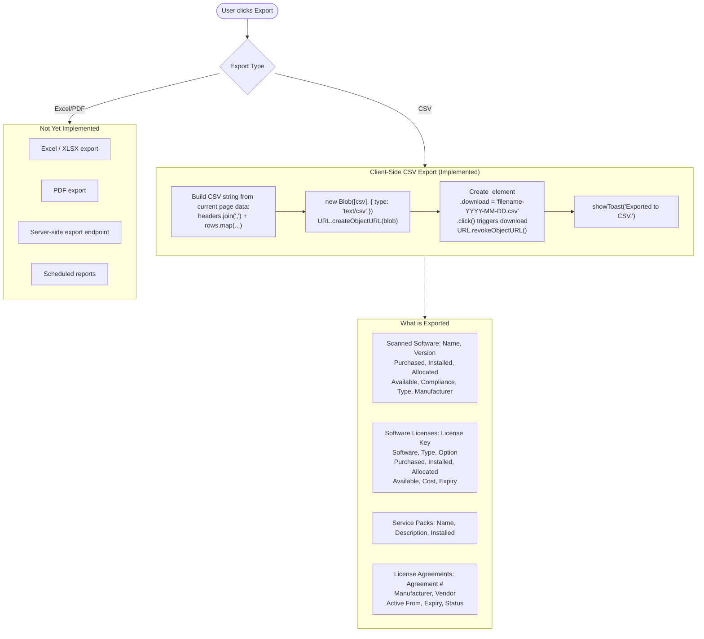

**Explanation:** All export functionality is client-side only, operating on the current page's in-memory data. This means exports are limited to the currently loaded page (e.g., 25 or 50 records), not the full dataset. Server-side export endpoints would be needed for full-dataset exports. The export button appears in the top-right of each list page's pagination row, inside an "Export as ▼" dropdown.

---

## 14. Data Relationship Diagram

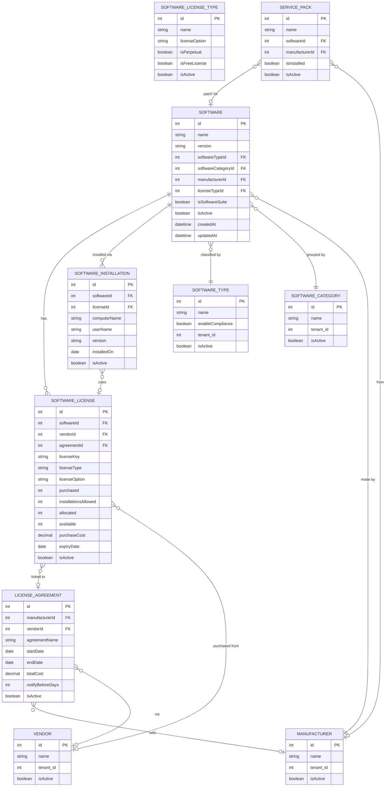

**Explanation:** `SOFTWARE` is the central entity. It connects to licenses (what you're allowed to run), installations (where it's actually running), and service packs (hotfixes/patches). `SOFTWARE_LICENSE.available` is a stored computed field: `installationsAllowed - allocated`. `LICENSE_AGREEMENT` links to `SOFTWARE_LICENSE` via `agreementId` (on the license, not a junction table). `tenant_id` exists on master tables (`MANUFACTURER`, `VENDOR`, `SOFTWARE_TYPE`, `SOFTWARE_CATEGORY`) but not on transactional tables.

---

## 15. Frontend Navigation Map

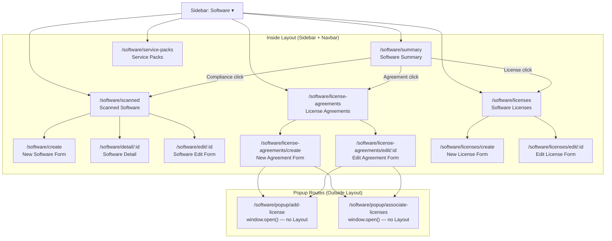

**Explanation:** All standard pages render inside the `<Layout>` component which provides the Sidebar and Navbar. The two popup pages (`/software/popup/*`) are registered **outside** the `<Layout>` Route so `window.open()` shows them as bare pages without navigation chrome. The `<Navigate>` redirects `/ → /dashboard` and `/software → /software/scanned`. The Dashboard's clickable counts navigate to filtered versions of the list pages using query params.

---

## Summary Table

| Module | Frontend Page | Backend Route | Key Validation | Soft Delete |
|--------|--------------|---------------|----------------|-------------|
| Scanned Software | `ScannedSoftwarePage` | `GET /api/softwares` | — | — |
| Software CRUD | `SoftwareFormPage` | `POST/PUT /api/softwares` | name, typeId, categoryId, mfrId | ✅ `isActive=false` |
| Software Detail | `SoftwareDetailPage` | `GET /api/softwares/:id` | — | — |
| Software Summary | `SoftwareSummaryPage` | `GET /api/software-summary` | — | — |
| License Agreements | `LicenseAgreementsPage` | `GET /api/license-agreements` | — | ✅ |
| Agreement Form | `LicenseAgreementFormPage` | `POST/PUT /api/license-agreements` | agreementName, startDate | ✅ |
| Add License Popup | `AddLicensePopupPage` | `POST /api/global-software-licenses` | softwareId, licenseType, licenseOption, installationsAllowed | — |
| Associate Popup | `AssociateLicensesPopupPage` | `PATCH /api/global-software-licenses/:id` | — | — |
| Software Licenses | `SoftwareLicensesPage` | `GET /api/global-software-licenses` | — | ✅ |
| License Form | `SoftwareLicenseFormPage` | `POST/PUT /api/global-software-licenses` | softwareId (int ≥ 1) | ✅ |
| Service Packs | `ServicePacksPage` | `GET/POST/PUT/DELETE /api/service-packs` | name required | ✅ |

---

*Documentation auto-derived from live codebase — routes, controllers, validators, page components, and type definitions.*
